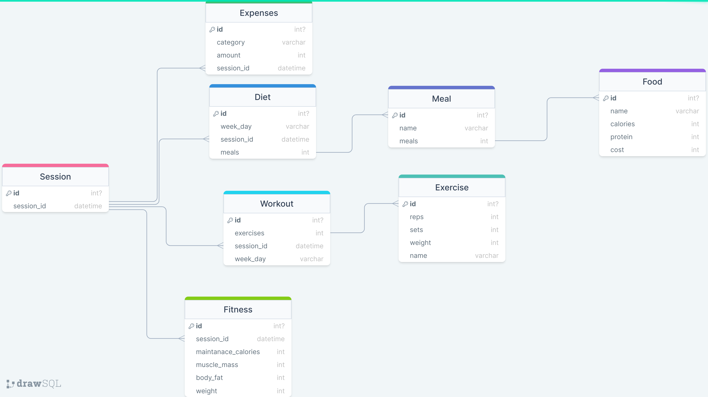
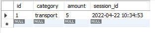

# Protocol Backend

In order to build the protocol backend you can use the following diagramming tool,
with the latest version being the [following](https://drawsql.app/teams/university-of-sheffield/diagrams/my-routine)
At the latest the database schema looks like the following

<div style="width:100%; display:flex; justify-content:center; align-items;center;">

</div>

The code that is exported can then be modified in virtual studio code as follows:

- include all the primary key statement of id at the bottom of the table
- remove all the backticks
- remove all the unsigned stuff
- make the ids not null for the sql server and then remove the not null for the python script

The current script looks like the following:
```sql
CREATE TABLE Session(
    id INT NOT NULL AUTO_INCREMENT,
    session_id DATETIME NOT NULL,
    PRIMARY KEY (id)
);
CREATE TABLE Food(
    id INT NOT NULL AUTO_INCREMENT,
    name VARCHAR(255) NOT NULL,
    calories INT NOT NULL,
    protein INT NOT NULL,
    cost INT NOT NULL,
    PRIMARY KEY (id)
);

CREATE TABLE Meal(
    id INT NOT NULL AUTO_INCREMENT,
    name VARCHAR(255) NOT NULL,
    meals INT NOT NULL,
    PRIMARY KEY (id)
);

CREATE TABLE Diet(
    id INT NOT NULL AUTO_INCREMENT,
    week_day VARCHAR(255) NOT NULL,
    session_id DATETIME NOT NULL,
    meals INT NOT NULL,
    PRIMARY KEY (id)
);

CREATE TABLE Exercise(
    id INT NOT NULL AUTO_INCREMENT,
    reps INT NOT NULL,
    sets INT NOT NULL,
    weight INT NOT NULL,
    name VARCHAR(255) NOT NULL,
    PRIMARY KEY (id)
);

CREATE TABLE Workout(
    id INT NOT NULL AUTO_INCREMENT,
    exercises INT NOT NULL,
    session_id DATETIME NOT NULL,
    week_day VARCHAR(255) NOT NULL,
    PRIMARY KEY (id)
);

CREATE TABLE Fitness(
    id INT NOT NULL AUTO_INCREMENT,
    session_id DATETIME NOT NULL,
    maintanace_calories INT NOT NULL,
    muscle_mass INT NOT NULL,
    body_fat INT NOT NULL,
    weight INT NOT NULL,
    PRIMARY KEY (id)
);

CREATE TABLE Expenses(
    id INT NOT NULL AUTO_INCREMENT,
    category VARCHAR(255) NOT NULL,
    amount INT NOT NULL,
    session_id DATETIME NOT NULL,
    PRIMARY KEY (id)
);

ALTER TABLE
    Diet ADD CONSTRAINT diet_meals_foreign FOREIGN KEY(meals) REFERENCES Meal(id);
ALTER TABLE
    Workout ADD CONSTRAINT workout_exercises_foreign FOREIGN KEY(exercises) REFERENCES Exercise(id);
ALTER TABLE
    Meal ADD CONSTRAINT meal_meals_foreign FOREIGN KEY(meals) REFERENCES Food(id);
```

To test the created database you can insert some test data as follows
```sql
INSERT INTO Session (session_id) VALUES ('2022-04-22 10:34:53.44');
INSERT INTO Expenses (category, amount, session_id) VALUES
("transport",5, '2022-04-22 10:34:53.44');
```

finally you can get one of the columns of one of the tables to see what it looks like
```sql
SELECT * FROM Expenses;
```

and this is what the data looks like
<div style="width:100%; display:flex; justify-content:center; align-items;center;">

</div>
